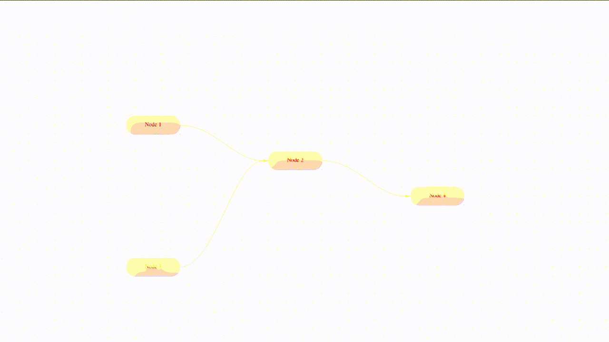

# GraphFlow

### At the moment this library is under development and not stable



Whats planned:

* support for html nodes, because it will allow huge customization possibilities
* wide configuration options for canvas, nodes and arrows
* respond to canvas and nodes resize
* draggable and scalable canvas with draggable nodes option
* nodes positioning layouts
* connections between nodes via ports
* zero dependencies
* framework independency in order to provide one easy to support API
* virtual scroll in order to optimize large graphs

## Probable API wid connectable nodes:
```
function createNode(text) {
    const node = document.createElement('div');

    node.innerText = text;
    node.classList.add('node');

    return node;
}

const el = document.querySelector("#canvas");
const canvas = new GraphFlow.Canvas(el);

const htmlNode1 = createNode('Node 1');
const htmlNode2 = createNode('Node 2');

canvas
    .addNode({ id: "1", html: htmlNode1, x: 200, y: 200 })
    .addNode({ id: "2", html: htmlNode2, x: 600, y: 200 })
    .connectNodes({ id: '1-to-2', from: "1", to: "2" });
```


## Probable API wid connectable ports:
```
function createNode(text) {
    const node = document.createElement('div');

    node.innerText = text;
    node.classList.add('node');

    return node;
}

function createPort(text) {
    const port = document.createElement('div');

    port.innerText = text;
    port.classList.add('port');

    return port;
}

const el = document.querySelector("#canvas");
const canvas = new GraphFlow.Canvas(el);

const htmlNode1 = createNode('Node 1');
const htmlNode2 = createNode('Node 2');

const htmlPort1 = createPort('Port for Node 1');
const htmlPort2 = createNode('Port for Node 2');

htmlNode1.appendChild(htmlPort1);
htmlNode2.appendChild(htmlPort2);

canvas
    .addNode({ id: "1", html: htmlNode1, x: 200, y: 200 })
    .addPort({ id: "port-1", nodeId: "1", html: htmlPort1 })
    .addNode({ id: "2", html: htmlNode2, x: 600, y: 200 })
    .addPort({ id: "port-2", nodeId: "2", html: htmlPort2 })
    .connectPorts({ id: 'port-1-to-port-2', from: "port-1", to: "port-2" });
```
